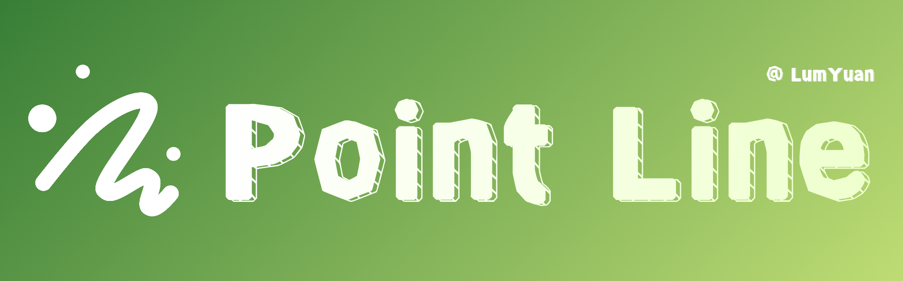

# Point-Line

<div align="center">


----
[](https://github.com/lumkit/Point-Line/blob/main/LICENSE)

Point-Line是一款基于Compose Multiplatform框架实现的绘画APP

</div>

***这个项目处于早期开发阶段，欢迎提交问题和合并请求***

## 支持平台

- [x] Android
- [x] iOS
- [x] Desktop
- [ ] ~~Js/WasmJs~~ （由于**DataStore**、**Room**等库在Js/WasmJs平台上的限制，
当前版本的Point-Line暂时不支持在Js/WasmJs平台上运行。
后期会抽象出Dao层在JS/WasmJs平台上实现持久化服务。）

## 功能
1. 画板
    - [x] 手势缩放
    - [x] 手势移动
    - [x] 手势旋转
    - [x] 平滑采样
    - [x] 撤销、重做
    - [x] 状态保存与恢复
    - [x] 离屏渲染、瓦片渲染
    - [x] 笔刷系统（待完善）
    - [x] 图层系统（待完善）

2. 应用层
    - [x] 分块存储（待完善）
    - [x] 缩略图预览

## 贡献者
<a href="https://github.com/lumkit/Point-Line/graphs/contributors">
  
</a>

## 许可证
```text
Point-Line is a open-source painting app that is built using the Compose Multiplatform framework.
https://github.com/lumkit/Point-Line

Copyright (C) 2025 lumkit (LumYuan)

This program is free software: you can redistribute it and/or modify
it under the terms of the GNU General Public License as published by
the Free Software Foundation, either version 3 of the License, or
(at your option) any later version.

This program is distributed in the hope that it will be useful,
but WITHOUT ANY WARRANTY; without even the implied warranty of
MERCHANTABILITY or FITNESS FOR A PARTICULAR PURPOSE. See the
GNU General Public License for more details.

You should have received a copy of the GNU General Public License
along with this program. If not, see https://www.gnu.org/licenses/
.

Please contact LumYuan by email at lumkit@163.com
 if you need
additional information or have any questions.
```
